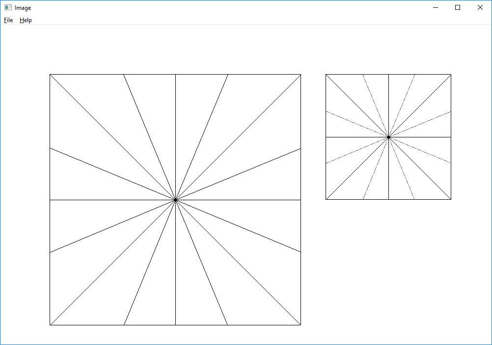

# Anti-Aliasing
This is an anti-aliasing in [spatial](https://en.wikipedia.org/wiki/Spatial_anti-aliasing) and [temporal](https://en.wikipedia.org/wiki/Temporal_anti-aliasing) domains for images and movies on Win32API(C++). This conducts spatial and temporal resampling and generates [aliasing](https://en.wikipedia.org/wiki/Aliasing) effects. In addition to aliasing, this processes anti-aliasing in both domains.


### Spatial resampling

In the image process, if we scale down an image, we choose a pixel according to the rate of scale. But this causes aliasing effect.

Left image is origin one and the right is scaled of the image. The scale rate is 1 over 2. The lines between diagonal and othogonal causes aliasing effect since each pixel of scaled image chooses one pixel and skip right next pixel and so on. In order to avoid aliasing effect, it apply low-pass filter to the image.


### Temporal resampling

When we look at the wagon wheel, it rotates oppositely if it rotates fast enough. Since the human's eyes can normally catch 30 frames per a seconds. So, the wheel rotates faster than this speed, it looks to rotate opposite way. According to the [Nyquist sampling theorem](https://en.wikipedia.org/wiki/Nyquist%E2%80%93Shannon_sampling_theorem), the sampling rate should be twice higher than frequency. If the wheel rotates 2 times per a second, the sampling rate should be more than 4 times per a second to prevent aliasing effects.


### The repository includes:
* Spatial-Anti-Aliasing source code - implement resampling of the image and anti-aliasing
* Temporal-Aliasing source code - implement resampling of the movie. It can test resampling and causes aliasing effect.
* Spatial-Temporal-Anti-Aliasing - implement anti-aliasing of above resampling.


### Building Environment
* Microsoft Window 10
* Microsoft Visual Studio Community 2015 Version 14.0.25431.01 Update 3


### Compile 
```bash
Set running configuration to Release
Build - Build Solution
```

### Run

Spatial-Anti-Aliasing
```bash
> %(Solution Dir)\Release\Mypart1.exe numOfLine scale antiAliasing <- 0: aliasing  1: anti-aliasing
ex) > %(Solution Dir)\Release\Mypart1.exe 16 2.0 0
```

Temporal-Aliasing
```bash
> %(Solution Dir)\Release\Mypart2.exe numOfLine speedOfRotation fpsOfSampling
ex) > %(Solution Dir)\Release\Mypart2.exe 64 4.0 10.0
```

Temporal-Aliasing
```bash
> %(Solution Dir)\Release\Mypart2.exe numOfLine speedOfRotation fpsOfSampling
ex) > %(Solution Dir)\Release\Mypart2.exe 64 4.0 10.0
```

Spatial-Temporal-Anti-Aliasing
```bash
> %(Solution Dir)\Release\Mypart2.exe numOfLine speedOfRotation fpsOfSampling scale antiAliasing <- 0: aliasing  1: anti-aliasing
ex) > %(Solution Dir)\Release\MyExtraCredit.exe 64 4.0 7.0 2.0 1
```

### Demo


### Status

This is the first assignment of CSCI-576 Multimedia System Design, 2018 fall

Version 1.0

